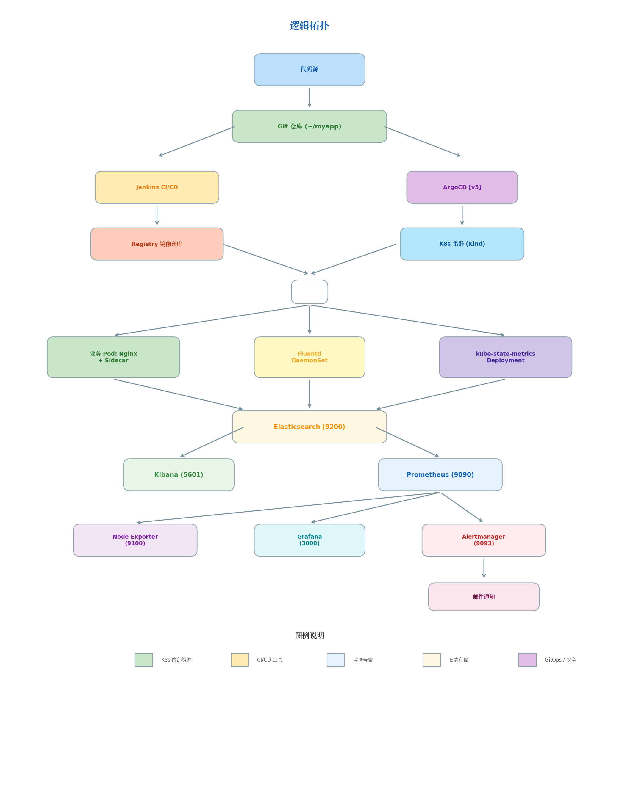
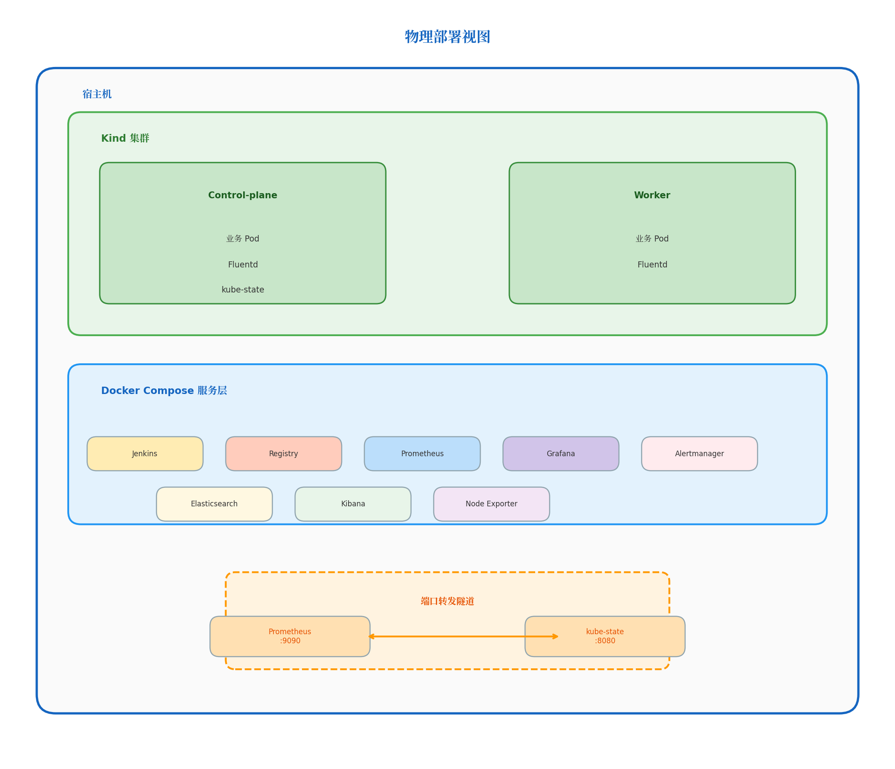

# DevOps Platform Lab — 云原生运维实践平台

[](https://opensource.org/licenses/MIT)

> **版本**: v5.1（初学者友好版）  
> **定位**: 从零开始、分阶段学习的 DevOps 实验环境。你不需要一次跑通所有东西，**跑通 Phase 1 就算成功**。

## ⚠️ 诚实声明

这个项目**对纯新手确实有门槛**。你需要：
- 一台至少有 **4GB 空闲内存** 的电脑（8GB 总内存勉强够 Phase 1）
- 愿意阅读报错信息并搜索解决方案的耐心
- 大约 **2-3 小时** 的连续时间（第一次搭建）

**如果你连 Docker 是什么都不知道**，建议先去 [Docker 官方教程](https://docs.docker.com/get-started/) 花 30 分钟跑一遍 `docker run hello-world`。

## 技术栈

| 组件 | 用途 | Phase | 必需？ |
|------|------|-------|--------|
| Prometheus | 指标采集 | 1 | ✅ 必学 |
| Grafana | 可视化大盘 | 1 | ✅ 必学 |
| Node Exporter | 宿主机指标 | 1 | ✅ 必学 |
| Elasticsearch | 日志存储 | 2 | ✅ 必学 |
| Kibana | 日志查询 | 2 | ✅ 必学 |
| Fluentd | 日志采集 | 2 | ✅ 必学 |
| Jenkins | CI/CD 引擎 | 3 | ✅ 必学 |
| Registry | 镜像仓库 | 3 | ✅ 必学 |
| Helm | 包管理 | — | ❌ 进阶（见 advanced/） |
| ArgoCD | GitOps | — | ❌ 进阶（见 advanced/） |
| Terraform | 基础设施即代码 | — | ❌ 进阶（见 advanced/） |

## 四、项目亮点与概述

### 项目亮点

| 亮点 | 说明 |
|------|------|
| 零硬编码 | `setup-env.sh` 自动检测 Docker 网关，换台电脑直接跑 |
| Makefile 封装 | `make up` / `make test` / `make down` 一键操作 |
| 一键恢复 | `make up` 处理镜像预拉取、Kind 镜像导入、端口转发重建，15 分钟从零到完整环境 |
| 数据不丢 | Prometheus / Grafana / ES / Jenkins 全部配置 Named Volume |
| 生产可迁移 | 所有 YAML 和脚本可直接搬到阿里云 ACK / AWS EKS / 腾讯云 TKE |
| 安全加固 | `.env` 权限 600、日志轮转、NetworkPolicy 隔离 [v5 新增] |
| 备份恢复 | `make backup` / `restore` 一键备份/恢复核心数据 |
| 一键诊断 | `make diagnose` 自动收集日志、状态、资源占用 |
| Helm 封装 [v5] | 业务应用提供完整 Helm Chart，支持多环境 Value 覆盖 |
| 镜像安全 [v5] | 集成 Trivy 镜像扫描、Cosign 镜像签名，构建阶段拦截漏洞 |
| AI 演进方向 | 规划接入智能告警降噪、日志异常检测、容量预测 |

### 核心能力

| 模块 | 技术组件 | 能力说明 |
|------|---------|---------|
| CI/CD | Jenkins + Registry | 代码提交后自动构建镜像、推送仓库、滚动更新 K8s 部署 |
| 监控 | Prometheus + Grafana | 实时采集宿主机与 K8s 集群指标，可视化仪表盘展示 |
| 日志 | Fluentd + Elasticsearch + Kibana | 容器日志统一收集、持久化存储、全文检索分析 |
| 告警 | Prometheus + Alertmanager | Pod 异常重启、组件宕机、磁盘/内存/节点压力时实时邮件通知 |
| GitOps [v5] | ArgoCD + Helm | 声明式持续交付，Git 为唯一可信源，自动同步、回滚 |
| 安全 [v5] | Trivy + Cosign + NetworkPolicy | 镜像漏洞扫描、签名验证、网络微隔离 |

### 为什么从本地环境开始?

**云服务器的问题:**
- 云服务按小时计费，折腾坏了心疼钱
- 网络环境复杂 (安全组、VPC、公网 IP)，问题排查困难
- 一旦搞砸了，重装系统成本高

**本地环境 (Kind + Docker Compose) 的优势:**
- **零成本**: 不用买服务器，在自己电脑上就能跑
- **恢复快**: 搞坏了 `make down` 一键清理，`make up` 10 分钟重建
- **可迁移**: 本地跑通的 YAML 和脚本，原封不动搬到阿里云、腾讯云、AWS 都能用
- **安全实验**: 本地可以大胆尝试 NetworkPolicy、安全策略等高风险操作

## 五、架构设计

### 逻辑拓扑



### 物理部署视图



### 网络设计要点 (新手必看)

| 数据流向 | 为什么这样设计 |
|---------|--------------|
| Prometheus → kube-state-metrics | Prometheus 在 K8s 外部，无法直接访问集群内部 Service。通过 `kubectl port-forward` 建立"隧道"，把内部端口映射到宿主机，Prometheus 才能抓取数据。 |
| Fluentd → Elasticsearch | Fluentd 在 K8s 内部 (DaemonSet)，ES 在外部且已暴露 9200 端口。内部 Pod 可以直接通过宿主机网关访问外部服务，不需要隧道。 |
| Jenkins → K8s API | Jenkins 容器内挂载了 `~/.kube` 和 kubectl，通过宿主机网络访问 Kind 集群 API Server。 |
| 业务 Pod → Registry | 通过 `${DOCKER_GATEWAY}:5000` 拉取镜像，Kind 的 containerd 已配置信任该 HTTP 仓库。 |
| [v5] Pod 间通信 | 通过 NetworkPolicy 限制，仅允许必要的流量，实现零信任网络。 |

> **一句话总结**: 谁在外面、谁想进去，谁就需要隧道。

### 端口速查表

| 端口 | 服务 | 谁访问它 | 备注 |
|------|------|---------|------|
| 8080 | kube-state-metrics | Prometheus (外部容器) | 通过 kubectl port-forward 暴露到宿主机 |
| 8081 | Jenkins | 用户浏览器 | 初始密码需 docker exec 获取 |
| 5000 | Registry | Kind 节点 / Jenkins | HTTP 协议，无认证 (本地简化) |
| 9090 | Prometheus | 用户浏览器 / Grafana | 自带 Web UI，可执行 PromQL |
| 9093 | Alertmanager | Prometheus / 用户浏览器 | 接收告警、管理静默/抑制 |
| 9200 | Elasticsearch | Fluentd / Kibana / 用户 | 单节点模式，无安全认证 |
| 5601 | Kibana | 用户浏览器 | 依赖 ES，启动较慢需等待 |
| 9100 | Node Exporter | Prometheus | 采集宿主机 CPU/内存/磁盘/网络 |
| 3000 | Grafana | 用户浏览器 | 默认账号 admin/admin |
| [v5] 8443 | ArgoCD | 用户浏览器 | GitOps 控制台 (生产环境) |

## 下载后第一步（必须执行）

```bash
# 1. 进入项目目录
cd devops-platform-lab

# 2. 加载环境变量并生成配置文件（会自动替换所有路径和网关地址）
source ./setup-env.sh

# 如果看到 "[OK] Docker 网关已检测" 和 "配置生成完成"，说明成功了
# 如果报错，请检查 Docker 是否正在运行
```

> **重要**: `setup-env.sh` 会**自动生成** `kind-config.yaml`、`prometheus.yml`、`fluentd-daemonset.yaml`，并更新 `docker-compose.yml` 中的家目录路径。**不要手动编辑这些文件**，否则换电脑后路径会出错。

## 快速开始（3 步）

```bash
# 第 1 步：安装依赖（如果已安装 Docker/kubectl/Kind，可跳过）
make install

# 第 2 步：检查环境
make check

# 第 3 步：启动 Phase 1（监控）
make phase1
```

然后打开浏览器访问：
- **Grafana**: http://localhost:3000（账号 admin/admin）
- **Prometheus**: http://localhost:9090

**如果这一步成功了，恭喜你，你已经跑通了 DevOps 的第一个链路！**

## 分阶段学习路径

```
Phase 1: 监控入门（4GB 内存）
    └── 目标：学会看 Grafana 大盘，理解 Prometheus 指标
    └── 预计时间：30 分钟
    └── 命令：make phase1
    └── 如果卡住了：跳过 Phase 2/3，先玩熟这个

Phase 2: 日志收集（+2GB 内存）
    └── 目标：在 Kibana 里查到容器日志
    └── 预计时间：20 分钟
    └── 命令：make phase2
    └── 如果卡住了：ES 启动慢是正常的，等 2-3 分钟

Phase 3: CI/CD 流水线（+2GB 内存）
    └── 目标：改一行代码，Jenkins 自动构建并部署到 K8s
    └── 预计时间：40 分钟（Jenkins 初始化占一半）
    └── 命令：make phase3
    └── 如果卡住了：Jenkins 配置可以手动在 Web UI 完成

【此时你已经掌握了完整的 DevOps 链路】

进阶：Helm + GitOps + Terraform（见 advanced/ 目录）
    └── 什么时候学：本地跑通所有 Phase 后
    └── 用途：生产环境迁移、多环境管理、基础设施自动化
```

## 项目结构

```
.
├── Makefile                    # ✅ 必学：一键命令（make phase1/phase2/phase3）
├── docker-compose.yml          # ✅ 必学：外部服务编排（Prometheus/Grafana/ES/Jenkins）
├── kind-config.yaml            # ✅ 必学：K8s 集群配置
├── setup-env.sh                # ✅ 必学：自动检测 Docker 网关
├── .env.example                # ✅ 必学：环境变量模板
├── .gitignore                  # ✅ 必学：敏感信息保护
├── .dockerignore               # ✅ 必学：Docker 构建优化
├── prometheus.yml              # ✅ 必学：监控抓取配置
├── alert.rules.yml             # ✅ 必学：告警规则
├── alertmanager.yml.example    # ✅ 必学：邮件告警模板（需复制为 alertmanager.yml）
├── app-deployment.yaml         # ✅ 必学：K8s 业务应用（Nginx + Sidecar）
├── fluentd-daemonset.yaml    # ✅ 必学：K8s 日志采集器
├── network-policy.yaml         # ✅ 必学：网络隔离策略
├── Jenkinsfile                 # ✅ 必学：CI/CD Pipeline 定义
├── myapp-example/              # ✅ 必学：示例应用代码（复制到 ~/myapp）
│   ├── index.html
│   ├── Dockerfile
│   └── README.md
├── scripts/                    # ✅ 必学：自动化脚本
│   ├── install-deps.sh         # 一键安装依赖
│   ├── check-prereqs.sh        # 环境检查
│   ├── deploy.sh               # 一键部署
│   ├── setup-jenkins.sh        # Jenkins 配置引导
│   ├── test.sh                 # 冒烟测试
│   ├── diagnose.sh             # 诊断信息收集
│   ├── cleanup.sh              # 清理环境
│   └── security-scan.sh        # 镜像安全扫描
├── docs/
│   └── troubleshooting.md      # ✅ 必学：故障排查指南
├── advanced/                   # ❌ 进阶：初学者搭建时不需要
│   ├── README.md               # 进阶内容说明和学习顺序
│   ├── helm-charts/            # Helm Chart（生产环境包管理）
│   ├── gitops/                 # ArgoCD 配置（声明式持续交付）
│   └── terraform/              # 阿里云 ACK 模板（基础设施即代码）
├── .github/workflows/ci.yml    # CI 工作流（GitHub 自动检查）
├── CHANGELOG.md
├── LICENSE
└── README.md                   # 本文件
```

> **初学者只需要关注根目录和 scripts/ 目录的文件。**  
> `advanced/` 目录下的内容在搭建过程中完全不需要使用。

## 日常命令

```bash
make help        # 查看所有可用命令
make status      # 看服务状态
make test        # 冒烟测试
make diagnose    # 出问题时收集诊断信息
make down        # 停止服务（保留数据）
make clean       # 彻底清理（删除所有数据）
```

## 常见问题（FAQ）

### Q1: 浏览器打不开 localhost:3000？

**WSL2 用户**：在 WSL2 终端执行 `ip addr | grep eth0`，用 `http://<IP>:3000` 访问  
**Mac 用户**：检查 Docker Desktop 端口映射  
**Linux 用户**：`sudo ufw status` 看防火墙是否拦截

### Q2: `make check` 报内存不足？

- **WSL2**: 在 Windows 创建 `C:\Users\<你>\.wslconfig`：
  ```
  [wsl2]
  memory=8GB
  processors=4
  ```
  保存后执行 `wsl --shutdown`，重新打开 WSL2
- **Mac**: Docker Desktop -> Settings -> Resources -> Memory 调到 8GB
- **如果只有 4GB 总内存**：只能跑 `make phase1`，Phase 2/3 会 OOM

### Q3: Elasticsearch 启动后自动退出？

执行 `sudo sysctl -w vm.max_map_count=262144`  
Mac 用户通过 Docker Desktop 设置（见上方）。

### Q4: Jenkins 构建失败？

1. `docker exec jenkins docker ps` — 看 Jenkins 里能不能用 Docker
2. `docker exec jenkins kubectl get nodes` — 看 Jenkins 里能不能连 K8s
3. `docker exec jenkins cat /home/ace/monitoring-lab/.env` — 看 .env 是否挂载成功

### Q5: advanced/ 目录里的文件什么时候用？

**答案是：搭建过程中完全不需要。**

- `helm-charts/`: 当你理解了 `app-deployment.yaml` 后，学习如何用 Helm 管理多环境
- `gitops/`: 当你跑通了 Jenkins Pipeline 后，学习如何用 ArgoCD 替代 Jenkins 直接操作 K8s
- `terraform/`: 当你要把环境搬到阿里云/腾讯云/AWS 时

建议的学习顺序见 `advanced/README.md`。

## 安全声明

- **本地学习专用**，生产环境需要：Harbor + TLS + 认证、ES 安全认证、Jenkins Kubernetes Agent
- Registry 无认证，不要暴露到公网
- `.env` 和 `alertmanager.yml` 含敏感信息，已加入 `.gitignore`

## License

[MIT](LICENSE)